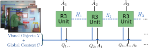

# [ECCV22] COST: Video Dialog as Conversation about Objects Living in Space-Time
This is the official implementation of the [Video Dialog as Conversation about Objects Living in Space-Time](https://arxiv.org/abs/2207.03656) paper.

We present a new object-centric framework for video dialog that supports neural reasoning dubbed COST. Here dynamic space-time visual content in videos is first parsed into object trajectories. Given this video abstraction, COST maintains and tracks object-associated dialog states, which are updated upon receiving new questions. Object interactions are dynamically and conditionally inferred for each question, and these serve as the basis for relational reasoning among them. COST also maintains a history of previous answers, and this allows retrieval of relevant object-centric information to enrich the answer forming process. Language production then proceeds in a step-wise manner, taking into the context of the current utterance, the existing dialog, the current question.




## Prerequisites
pip install -r requirements.txt

## Preprocessing
Refer to preprocess/README.md

## Training
Multi-GPU Training

`python -m torch.distributed.launch --use_env --nproc_per_node=8 train.py --config configs/mycfg.yml TRAIN.BATCH_SIZE 512 SYSTEM.NUM_WORKERS 32 OPT.BASE_LR 3e-3 OPT.WARMUP_EPOCHS 8 TRAIN.EPOCHS 50 EXPERIMENT myexp`

## Testing
Multi-GPU Testing

`python -m torch.distributed.launch --use_env --nproc_per_node=8 train.py --config configs/mycfg.yml --resume weights/best_myexp.pth --test-only TRAIN.BATCH_SIZE 512 SYSTEM.NUM_WORKERS 32 OPT.BASE_LR 3e-3 OPT.WARMUP_EPOCHS 5 TRAIN.EPOCHS 50`

# Citations
If you make use of this repository for your research, please cite the following paper:
```
@misc{
    pham2022video,
    title={Video Dialog as Conversation about Objects Living in Space-Time}, 
    author={Hoang-Anh Pham and Thao Minh Le and Vuong Le and Tu Minh Phuong and Truyen Tran},
    year={2022},
    eprint={2207.03656},
    archivePrefix={arXiv},
    primaryClass={cs.CV}
}
```
